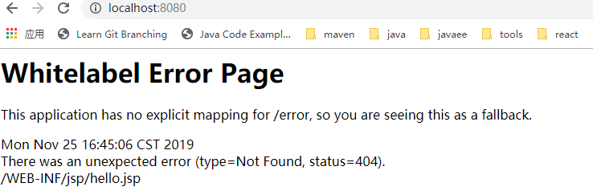
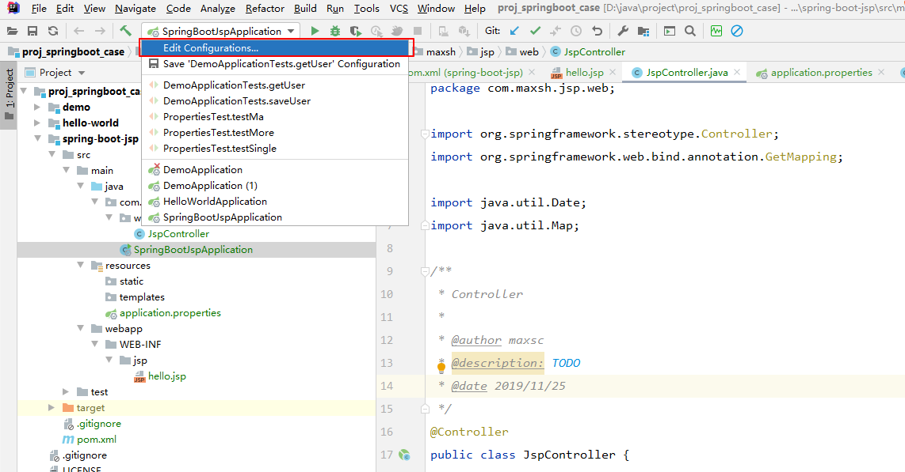
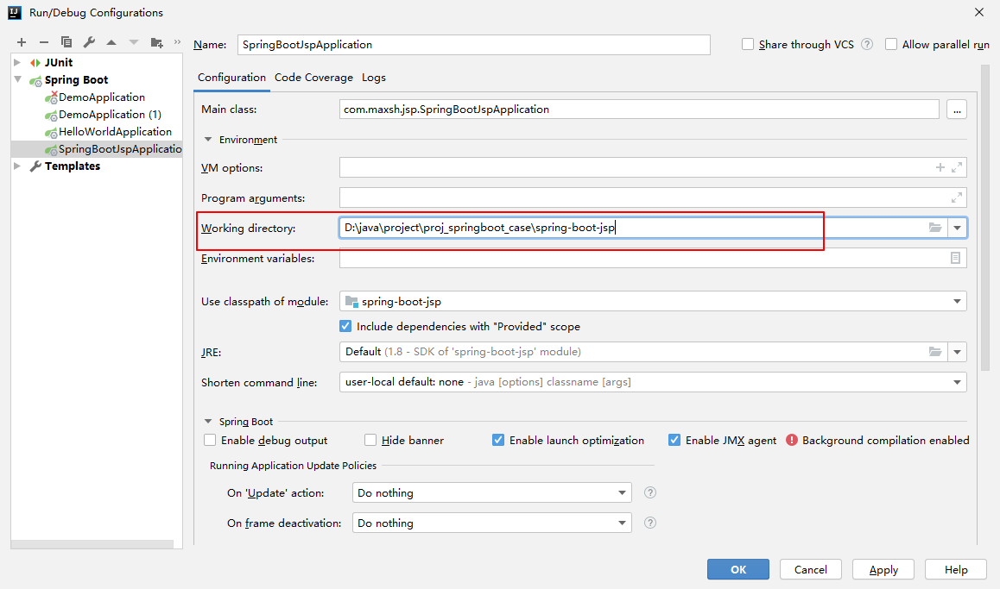
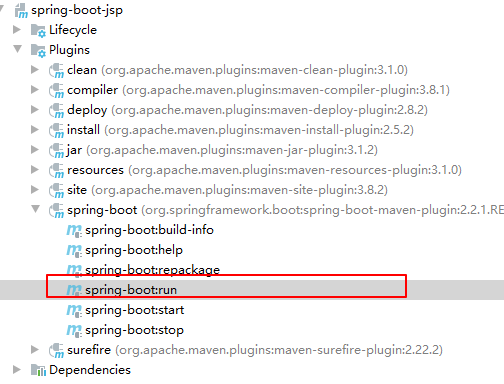

# SpringBoot中使用jsp

 ##  项目结构


首先看一下添加 JSP 支持后的项目结构：  对比以前的项目结构 main 目录下多了 webapp 目录，用来存放目录 jsp 文件。 

```
项目结构
spring-boot-jsp
|-- pom.xml
`-- src
    |-- main
    | |-- java
    | | `-- com
    | |     `-- maxsh
    | |         `-- jsp
    | |-- resources
    | | |-- application.properties
    | | |-- static
    | | `-- templates
    | `-- webapp
    |     `-- WEB-INF
    |         `-- jsp
    |             `-- hello.jsp
    `-- test
        `-- java
            `-- com
                `-- maxsh
                    `-- jsp

```


##   配置文件

 需要在application.properties配置文件中指定 jsp 的位置和后缀。 

```properties
spring.mvc.view.prefix=/WEB-INF/jsp/
spring.mvc.view.suffix=.jsp
```

- spring.mvc.view.prefix 指明 jsp 文件在 webapp 下的哪个目录
- spring.mvc.view.suffix 指明 jsp 以什么样的后缀结尾


##  引入依赖包

```
<dependency>
    <groupId>org.springframework.boot</groupId>
    <artifactId>spring-boot-starter-web</artifactId>
</dependency>
<dependency>
    <groupId>javax.servlet</groupId>
    <artifactId>jstl</artifactId>
</dependency>
<dependency>
    <groupId>org.apache.tomcat.embed</groupId>
    <artifactId>tomcat-embed-jasper</artifactId>
</dependency>
```

 jstl 是一个 JSP 标签集合，它封装了 JSP 应用的通用核心功能。 

 tomcat-embed-jasper 主要用来支持 JSP 的解析和运行。 


##  编写页面

写一个简单的页面：

```html
<!DOCTYPE html>
<html lang="en">

<body>
    Time:  ${time}
    <br>
    Message: ${message}
</body>

</html>
```


再写一个controller:

```java
@Controller
public class JspController {
    @GetMapping("/")
    public String welcome(Map<String, Object> model) {
        model.put("time", new Date());
        model.put("message", "hello Jsp");
        return "hello";
    }
}
```


</br></br></br>

- **在 IDEA 中运行**,右键单击项目中的 SpringBootJspApplication| run 命令，启动项目， 在浏览器中访问地址：http://localhost:8080/ ,此时发现返回404




 这是因为 Spring Boot JSP 项目需要额外进行一个设置：选择 Edit Configurations 选项，打开 Run/Debug Configurations： 



 然后重启项目就可以正常的访问到页面内了。 



- 使用springboot的maven插件启动




或者 cmd 进入项目跟路径下 执行以下命令启动： 

```
mvn clean spring-boot:run
```

 


##  常用示例

