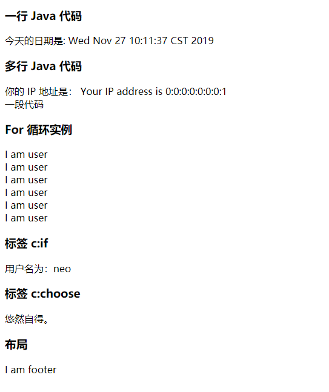
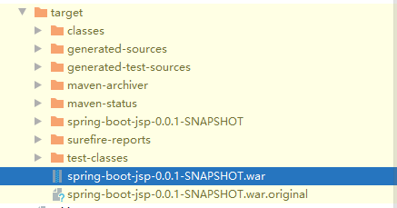
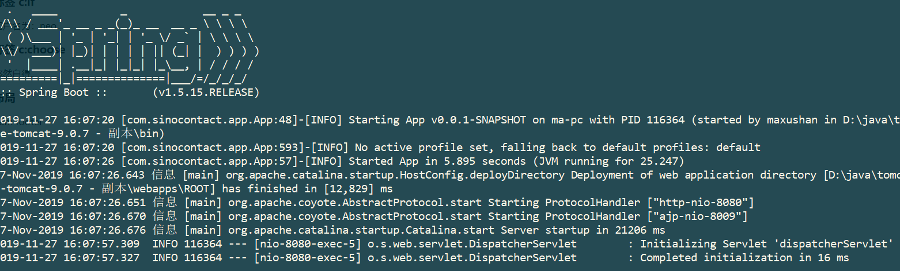

# SpringBoot中使用jsp

##  项目结构


首先看一下添加 JSP 支持后的项目结构：  对比以前的项目结构 main 目录下多了 webapp 目录，用来存放目录 jsp 文件。 

```
项目结构
spring-boot-jsp
|-- pom.xml
`-- src
    |-- main
    | |-- java
    | | `-- com
    | |     `-- maxsh
    | |         `-- jsp
    | |-- resources
    | | |-- application.properties
    | | |-- static
    | | `-- templates
    | `-- webapp
    |     `-- WEB-INF
    |         `-- jsp
    |             `-- hello.jsp
    `-- test
        `-- java
            `-- com
                `-- maxsh
                    `-- jsp

```


##   配置文件

 需要在application.properties配置文件中指定 jsp 的位置和后缀。 

```properties
spring.mvc.view.prefix=/WEB-INF/jsp/
spring.mvc.view.suffix=.jsp
```

- spring.mvc.view.prefix 指明 jsp 文件在 webapp 下的哪个目录
- spring.mvc.view.suffix 指明 jsp 以什么样的后缀结尾


##  引入依赖包

```
<dependency>
    <groupId>org.springframework.boot</groupId>
    <artifactId>spring-boot-starter-web</artifactId>
</dependency>
<dependency>
    <groupId>javax.servlet</groupId>
    <artifactId>jstl</artifactId>
</dependency>
<dependency>
    <groupId>org.apache.tomcat.embed</groupId>
    <artifactId>tomcat-embed-jasper</artifactId>
</dependency>
```

 jstl 是一个 JSP 标签集合，它封装了 JSP 应用的通用核心功能。 

 tomcat-embed-jasper 主要用来支持 JSP 的解析和运行。 


##  编写页面

写一个简单的页面：

```html
<!DOCTYPE html>
<html lang="en">

<body>
    Time:  ${time}
    <br>
    Message: ${message}
</body>

</html>
```


再写一个controller:

```java
@Controller
public class JspController {
    @GetMapping("/")
    public String welcome(Map<String, Object> model) {
        model.put("time", new Date());
        model.put("message", "hello Jsp");
        return "hello";
    }
}
```


</br></br></br>

- **在 IDEA 中运行**,右键单击项目中的 SpringBootJspApplication| run 命令，启动项目， 在浏览器中访问地址：http://localhost:8080/ ,此时发现返回404


 这是因为 Spring Boot JSP 项目需要额外进行一个设置：选择 Edit Configurations 选项，打开 Run/Debug Configurations： 


 然后重启项目就可以正常的访问到页面内了。 


- 使用springboot的maven插件启动


或者 cmd 进入项目跟路径下 执行以下命令启动： 

```
mvn clean spring-boot:run
```

 


##  常用示例

在JspController中 定义一个 user() 的方法，设置一些值从后端传递到前端： 

```java
@GetMapping("/user")
public String user(Map<String, Object> model, HttpServletRequest request) {
    model.put("username", "neo");
    model.put("salary", 666);
    request.getSession().setAttribute("count",6);
    return "user";
}
```

新建user.jsp  在 user.jsp 文件头部添加两个标签： 

```jsp
<%@ page language="java" contentType="text/html; charset=UTF-8" pageEncoding="UTF-8"%>
<%@ taglib uri="http://java.sun.com/jsp/jstl/core" prefix="c" %><html lang="en">
```

 引入第一个标签是为了让页面支持中文展示，第二个标签引入表示页面使用 jstl 语法来处理页面逻辑。 

 可以直接在 jsp 页面中使用 Java 代码，如果是一行 Java 代码使用`<%= %>`的语法，如果是多行 Java 代码则使用`<% %>`的语法，For 循环是页面最常用的功能之一，一般用在循环展示表格、列表等，示例如下： 

```jsp
<!DOCTYPE html>
<%@ page language="java" contentType="text/html; charset=UTF-8" pageEncoding="UTF-8"%>
<%@ taglib uri="http://java.sun.com/jsp/jstl/core" prefix="c" %><html lang="en">
<body>
    <h3>一行 Java 代码</h3>
    <p>
        今天的日期是: <%=(new java.util.Date())%>
    </p>
    <h3>多行 Java 代码</h3>
    <p>
        你的 IP 地址是：
        <%
            out.println("Your IP address is " + request.getRemoteAddr()+"</br>");
            out.println("一段代码 ");
        %>
    </p>
</body>
</html>
```


 页面常常会使用一些逻辑判断，使用 jstl 语法很容易实现这些功能。 

```jsp
<h3>标签 c:if</h3>
<c:if test="${username !=null}">
	<p>用户名为：${username}<p>
</c:if>
```

 当有多条件判断时可以使用  `<c:choose>` 更方便。 

```jsp
<h3>标签 c:choose</h3>
<c:choose>
    <c:when test="${salary <= 0}">
        惨不忍睹。
    </c:when>
    <c:when test="${salary > 1000}">
        马马虎虎。
    </c:when>
    <c:otherwise>
        悠然自得。
    </c:otherwise>
</c:choose>
```

 JSP 可以通过 include 指令来实现复用的页面， nclude 指令用于在编译阶段包括一个文件，这个指令告诉容器在编译阶段，把其他外部文件的内容合并到当前 JSP 文件中，可在 JSP 页面的任何位置使用 include 指令进行编码。  include 有两种用法：`<%@ include file="relative url"%>`和``。前者是在翻译阶段执行，后者是在请求处理阶段执行；前者叫作静态包含，后者叫作动态包含，会在执行时检查包含内容变化。两者使用语法没有太大区别。

 新建一个 footer.jsp 内容如下： 

```jsp
<!DOCTYPE html>
<%@ page language="java" contentType="text/html; charset=UTF-8" pageEncoding="UTF-8"%>
    <body>
       I am footer
    </body>
</html>
```

 在 user.jsp 页面中引入 footer.jsp： 

```jsp
<h3>布局</h3>
<%@include file="footer.jsp"%>
```

 启动项目在浏览器中输入网址：http://localhost:8080/user，页面展示效果如下： 




## 在tomcat中运行

1. **在 pom.xml 里设置打包格式为 war。**

```
<packaging>war</packaging>
```


2. **排除内嵌的 Tomcat 依赖 **

```
<dependency>
    <groupId>org.springframework.boot</groupId>
    <artifactId>spring-boot-starter-web</artifactId>
    <!-- 排除内置容器，排除内置容器导出成 war 包可以让外部容器运行spring-boot项目-->
    <exclusions>
        <exclusion>
            <groupId>org.springframework.boot</groupId>
            <artifactId>spring-boot-starter-tomcat</artifactId>
        </exclusion>
    </exclusions>
</dependency>
```


3. **添加Servlet 的支持 **

   Spring Boot 项目必须实现 SpringBootServletInitializer 接口的 configure() 方法才能让外部容器运行 Spring Boot 项目，启动类同目录下创建 ServletInitializer 类： 

```java
public class ServletInitializer extends SpringBootServletInitializer {
    @Override
    protected SpringApplicationBuilder configure(SpringApplicationBuilder application) {
        return application.sources(JspApplication.class);
    }
}
```


4. **打包发布，在项目根目录执行 maven 命令 **

```
mvn clean package
```


5. **将 war 包发布到 Tomcat 即可。 **



将生成的war包放到Tomcat的webapps下，启动tomcat




::: tip 源码 
[源码链接]( https://github.com/maxsh-io/proj_springboot_case/tree/master/spring-boot-jsp ) 
:::
