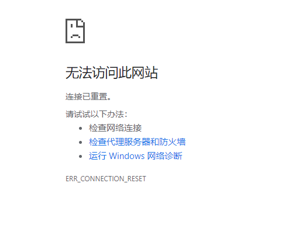

---

description: springboot 和Freemarker 文件上传
---

# SpringBoot和Freemarker文件上传

在项目中上传文件是一个高频的使用场景，常用的案例有上传头像、上传身份证信息和附件等等。 Spring Boot 利用 MultipartFile 的特性来接收和处理上传的文件，MultipartFile 是 Spring 的一个封装的接口，封装了文件上传的相关操作，利用 MultipartFile 可以方便地接收前端文件，将接收到的文件存储到本机或者其他中间件中。  


##  添加依赖

 引入了 spring-boot-starter-freemarker做页面模板引擎。

```xml
<dependency>
    <groupId>org.springframework.boot</groupId>
    <artifactId>spring-boot-starter-freemarker</artifactId>
</dependency>
<dependency>
    <groupId>org.springframework.boot</groupId>
    <artifactId>spring-boot-starter-web</artifactId>
</dependency>
```

 

## 配置信息

配置项主要是通过设置 MultipartFile 的属性来控制上传限制，MultipartFile 是 Spring 上传文件的封装类，包含了文件的二进制流和文件属性等信息，在配置文件中也可对相关属性进行配置。 

```
#支持的最大文件
spring.servlet.multipart.max-file-size=100MB
#文件请求最大限制
spring.servlet.multipart.max-request-size=100MB
```


 除过以上配置，常用的配置信息如下： 

```
spring.servlet.multipart.enabled=true，是否支持 multipart 上传文件
spring.servlet.multipart.file-size-threshold=0，支持文件写入磁盘
spring.servlet.multipart.location=，上传文件的临时目录
spring.servlet.multipart.max-file-size=10Mb，最大支持文件大小
spring.servlet.multipart.max-request-sizee=10Mb，最大支持请求大小
spring.servlet.multipart.resolve-lazily=false，是否支持 multipart 上传文件时懒加载
```


::: warning 注意
在使用2.2.1.RELEASE版本FreeMarker自动装配中，将freemarker的默认后缀改为`.ftlh`

详见FreeMarkerAutoConfiguration自动装配中的FreeMarkerProperties类，

```java
public static final String DEFAULT_TEMPLATE_LOADER_PATH = "classpath:/templates/";
public static final String DEFAULT_PREFIX = "";
public static final String DEFAULT_SUFFIX = ".ftlh";
```

所以需要配置freemarker页面后缀。

```
spring.freemarker.suffix=.ftl
```

或者更改freemarker页面后缀为`.ftlh`

:::


## 上传单个文件

编写freemark页面

```html
<!DOCTYPE html>
<html lang="en">
<head>
    <meta charset="UTF-8">
    <title>Upload</title>
</head>
<body>
<h1>Spring Boot 文件上传</h1>
<form method="post" action="/upload" enctype="multipart/form-data">
    <input type="file" name="file" />
    <input type="submit" value="上传" />
</form>
</body>
</html>
```

定义上传的位置：

```
##文件上传的盘符
file.path=D:/upload/
```

编写上传结果页

```HTML
<!DOCTYPE html>
<html lang="en">
<head>
    <meta charset="UTF-8">
    <title>Upload</title>
</head>
<body>

<#if message??>
    <div>
        <h2>${message}</h2>
    </div>
</#if>
</body>
</html>
```

上传controller中的处理方法：

```java
@PostMapping("/upload")
public String singleFileUpload(@RequestParam("file") MultipartFile file,
                               RedirectAttributes redirectAttributes) {
    if (file.isEmpty()) {
        redirectAttributes.addFlashAttribute("message", "Please select a file to upload");
        return "redirect:uploadResult";
    }
    try {
        byte[] bytes = file.getBytes();
        Path path = Paths.get(filePath + file.getOriginalFilename());
        Files.write(path, bytes);
        redirectAttributes.addFlashAttribute("message", "You successfully uploaded '" + file.getOriginalFilename() + "'");
    } catch (IOException e) {
        e.printStackTrace();
    }
    return "redirect:/uploadResult";
}
```


## 上传多个文件

添加可以支持多文件上传的页面。

```html
<!DOCTYPE html>
<html lang="en">
<head>
    <meta charset="UTF-8">
    <title>Upload</title>
</head>
<body>
<h1>Spring Boot 文件上传</h1>
<form method="post" action="/upload" enctype="multipart/form-data">
    文件1：<input type="file" name="file" />
    文件2：<input type="file" name="file" />
    文件3：<input type="file" name="file" />
    <input type="submit" value="上传" />
</form>
</body>
</html>
```

在controller 中添加访问入口

```java
@GetMapping("/multi")
public String uploadMore() {
    return "multi-upload";
}
```

 处理方法中MultipartFile 需要修改为按照数组的方式去接收 

```java
@PostMapping("/multiUpload")
public String multiUpload(@RequestParam("file") MultipartFile[] files,
                          RedirectAttributes redirectAttributes) {
    if (files.length==0) {
        redirectAttributes.addFlashAttribute("message", "Please select a file to upload");
        return "redirect:uploadResult";
    }
    for(MultipartFile file:files){
        try {
            byte[] bytes = file.getBytes();
            Path path = Paths.get(filePath + file.getOriginalFilename());
            Files.write(path, bytes);
        } catch (IOException e) {
            e.printStackTrace();
        }
    }
    redirectAttributes.addFlashAttribute("message", "You successfully uploaded all");
    return "redirect:/uploadResult";
}
```


## 上传大于100M文件

 TomcatServletWebServerFactory() 方法主要是为了解决上传文件大于 10M 出现连接重置的问题。

```java
//Tomcat large file upload connection reset
@Bean
public TomcatServletWebServerFactory tomcatEmbedded() {
    TomcatServletWebServerFactory tomcat = new TomcatServletWebServerFactory();
    tomcat.addConnectorCustomizers((TomcatConnectorCustomizer) connector -> {
        if ((connector.getProtocolHandler() instanceof AbstractHttp11Protocol<?>)) {
            //-1 means unlimited
            ((AbstractHttp11Protocol<?>) connector.getProtocolHandler()).setMaxSwallowSize(-1);
        }
    });
    return tomcat;
}
```

此异常内容 GlobalException 也捕获不到。 




> :smiley:  ​[源码链接](  https://github.com/maxsh-io/proj_springboot_case/tree/master/upload ) 