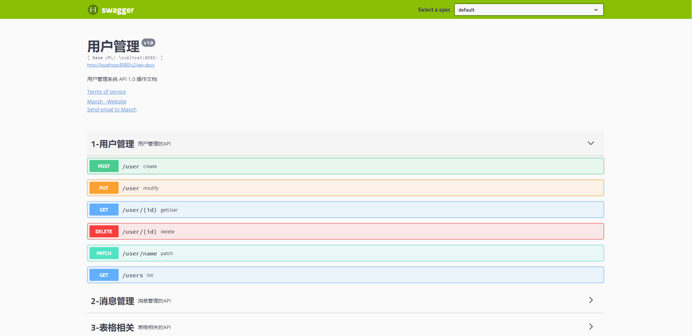
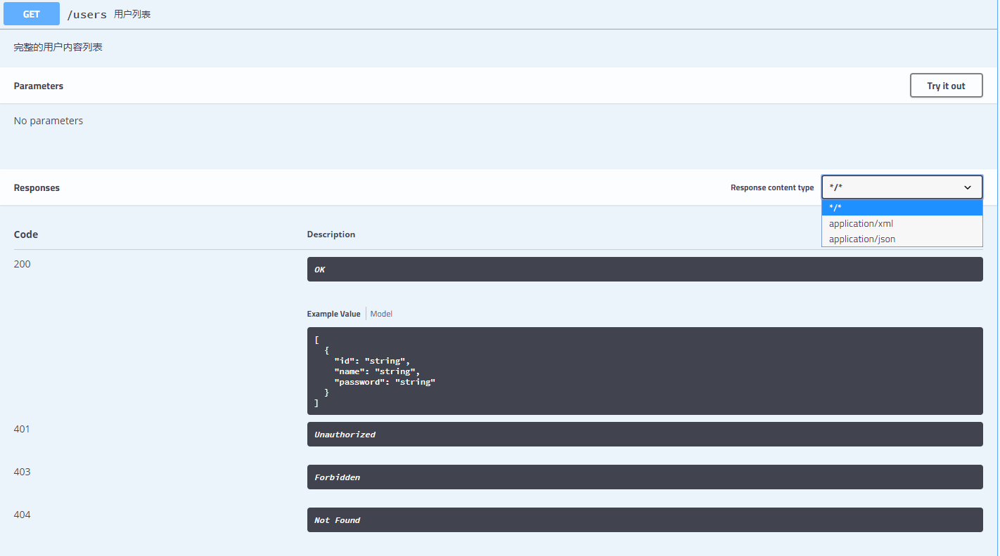
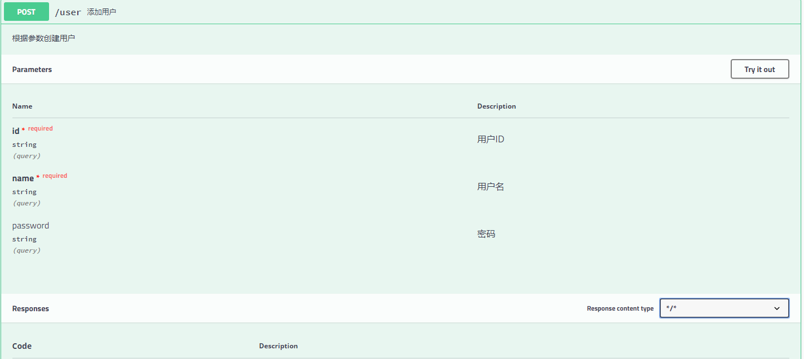
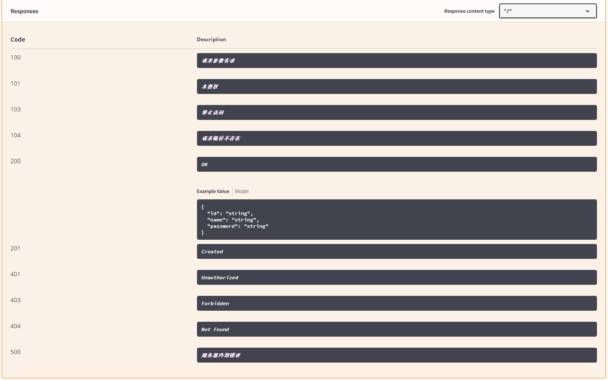
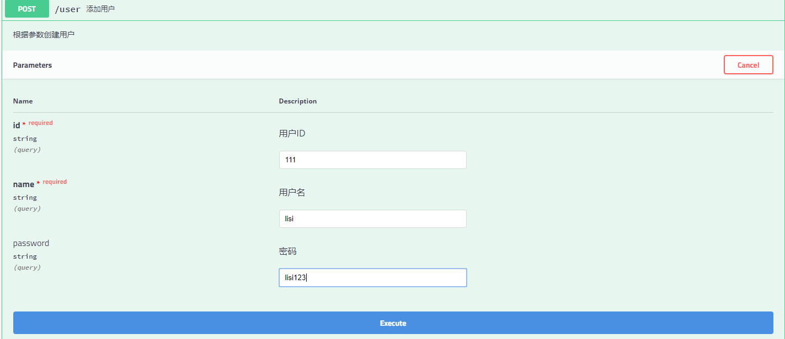
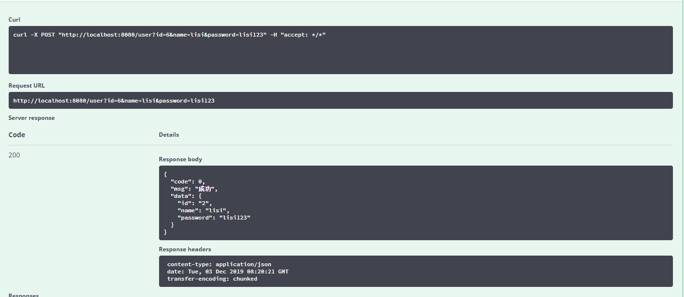

---

description: Swagger 2 构建API文档
---

# Springboot集成Swagger 2 构建API文档

## 什么是Swagger

Swagger UI允许任何人（无论您是开发团队还是最终用户）都可以可视化API资源并与之交互，而无需任何实现逻辑。它是根据您的OpenAPI（以前称为Swagger）规范自动生成的，具有可视化文档，可简化后端实现和客户端使用。 

> [官网介绍]( https://swagger.io/ )
>
> [Swagger-ui]( https://swagger.io/tools/swagger-ui/ )

## 添加依赖

```xml
<dependency>
    <groupId>io.springfox</groupId>
    <artifactId>springfox-swagger2</artifactId>
    <version>2.8.0</version>
</dependency>
<dependency>
    <groupId>io.springfox</groupId>
    <artifactId>springfox-swagger-ui</artifactId>
    <version>2.8.0</version>
</dependency>
```


## 创建Swagger配置类

项目中新建config包，新建 **SwaggerConfig** 配置类

```java
@Configuration
@EnableSwagger2
public class SwaggerConfig {
}
```

在spring中注册 Docket（Swagger API 摘要），其中 指定需要扫描的包路径，只有此路径下的 Controller 类才会自动生成 Swagger API 文档.apis(RequestHandlerSelectors.basePackage("com.maxsh.swagger.web"))。ApiInfo主要配置页面展示的基本信息包括，标题、描述、版本、服务条款、联系方式等， 


```java
@Bean
public Docket api() {
    return new Docket(DocumentationType.SWAGGER_2)
        .apiInfo(apiInfo())
        .select()
        // 自行修改为自己的包路径
        .apis(RequestHandlerSelectors.basePackage("com.maxsh.swagger.web"))
        .paths(PathSelectors.any())
        .build();
}

private ApiInfo apiInfo() {
    return new ApiInfoBuilder()
        .title("用户管理")
        .description("用户管理系统 API 1.0 操作文档")
        //服务条款网址
        .termsOfServiceUrl("http://www.maxsh.cn/")
        .version("1.0")
        .contact(new Contact("Maxsh", "http://www.maxsh.cn/", "869209045@qq.com"))
        .build();
}
```

 配置完成之后启动项目，在浏览器中输入网址 http://localhost:8080/swagger-ui.html， 即可看到swagger文档了。


## Swagger常用注解

Swagger默认配置没有具体的字段信息和ocntroller信息，可以通过一些注解表明该接口文档，包括接口名、请求方法、参数、返回信息等。

| 注解               | 作用范围           | 使用位置                           |
| ------------------ | ------------------ | ---------------------------------- |
| @Api               | 协议集描述         | 用于 Controller 类上               |
| @ApiOperation      | 协议描述           | 用在 Controller 的方法上           |
| @ApiImplicitParams | 非对象参数集       | 用在 Controller 的方法上           |
| @ApiImplicitParam  | 非对象参数描述     | 用在 @ApiImplicitParams 的方法里边 |
| @ApiResponses      | 响应集             | 用在 Controller 的方法上           |
| @ApiResponse       | 响应信息参数       | 用在 @ApiResponses 里边            |
| @ApiModel          | 描述返回对象的意义 | 用在返回对象类上                   |
| @ApiModelProperty  | 对象属性           | 用在出入参数对象的字段上           |


### @Api 的使用

| <div style="width:100px;">属性名称</div> | 备注                                             |
| ---------------------------------------- | ------------------------------------------------ |
| value                                    | url 的路径值                                     |
| tags                                     | 如果设置这个值，value 的值会被覆盖               |
| description（@Deprecated）               | 对 API 资源的描述                                |
| produces                                 | For example, "application/json, application/xml" |
| consumes                                 | For example, "application/json, application/xml" |
| protocols                                | Possible values: http, https, ws, wss            |
| authorizations                           | 高级特性认证时配置                               |
| hidden                                   | 配置为 true 将在文档中隐藏                       |

::: warning 注意

在swagger-annotations jar包中 1.5.X版本以上, 注解 io.swagger.annotations.API * 中的description被废弃了。新的swagger组件中使用了新的方法来对Web api 进行分组。原来使用 description ，默认一个Controller类中包含的方法构成一 个api分组。现在使用tag，可以更加方便的分组。比如把两个Controller类里的方法划分成同一个分组。tag的key用来区分不同的分组。tag的value用做分组的描述。

:::

所以调整SwaggerConfig类中的配置

```java
@Configuration
@EnableSwagger2
public class SwaggerConfig {
    @Bean
    public Docket api() {
        return new Docket(DocumentationType.SWAGGER_2)
                .apiInfo(apiInfo())
                .tags(new Tag("1-用户管理", "用户管理的API"), getTags())
                .select()
                // 自行修改为自己的包路径
                .apis(RequestHandlerSelectors.basePackage("com.maxsh.swagger.web"))
                .paths(PathSelectors.any())
                .build();
    }

    private Tag[] getTags() {
        Tag[] tags = {
                new Tag("2-消息管理", "消息管理的API"),
                new Tag("3-表格相关", "表格相关的API")
        };
        return tags;
    }

    private ApiInfo apiInfo() {
        return new ApiInfoBuilder()
                .title("用户管理")
                .description("用户管理系统 API 1.0 操作文档")
                //服务条款网址
                .termsOfServiceUrl("http://www.maxsh.cn/")
                .version("v 1.0")
                .contact(new Contact("Maxsh", "http://www.maxsh.cn/", "869209045@qq.com"))
                .build();
    }
}
```

@Api 作用在 Controller 类上，做为 Swagger 文档资源，该注解将一个 Controller标注为一个 Swagger 资源（API）。 在UserController上添加`@Api(tags={"1-用户管理"})`.




> [参考文章]( https://www.cnblogs.com/didispace/p/11639671.html )

::: tip 总结

- 可以将多个controller中的API通过Tag划入一个分组中，比如UserAddressController 和 UserController 的 Api 注解的 tags 参数都使用 了key=user 的tag。在文档中，可以看到 这两个Controller的web api 被放在同一个 分组中。
- 更细粒度的接口分组可以通过使用`@ApiOperation`注解中的`tags`属性做更细粒度的接口分类定义 ， 比如这样的需求：“教学管理”包含“教师管理”中所有接口以及“学生管理”管理中的“获取学生清单”接口（不是全部接口）。 

:::

### @ApiOperation 的使用

 ApiOperation 定义在方法上，描述方法名、方法解释、返回信息、标记等信息。 

::: tip @ApiOperation

@ApiOperation 中value是api的简要说明，在界面api 链接的右侧，少于120个字符

@ApiOperation 中notes是api的详细说明，需要点开api 链接才能看到

@ApiOperation 中 produces 用来标记api返回值的具体类型

:::


| 属性名称          | 备注                                                         |
| ----------------- | ------------------------------------------------------------ |
| value             | url 的路径值                                                 |
| tags              | API分组用                                                    |
| produces          | For example, "application/json, application/xml"             |
| consumes          | For example, "application/json, application/xml"             |
| protocols         | Possible values: http, https, ws, wss                        |
| authorizations    | 高级特性认证时配置                                           |
| hidden            | 配置为 true 将在文档中隐藏                                   |
| response          | 返回的对象                                                   |
| responseContainer | 这些对象是有效的 "List", "Set" or "Map"，其他无效            |
| httpMethod        | "GET"、"HEAD"、"POST"、"PUT"、"DELETE"、"OPTIONS" and "PATCH" |
| code              | http 的状态码 默认 200                                       |
| extensions        | 扩展属性                                                     |

使用示例

```java
@ApiOperation(value = "用户列表", notes = "完整的用户内容列表",
              produces="application/json, application/xml",
              consumes="application/json, application/xml")
@GetMapping("/users")
public List<User> list() {
    return userRepository.findAll();
}
```

重启之后查看查询用户就可以看到如下效果




### @ApiImplicitParams 和 @ApiImplicitParam 的使用

| 属性名称     | 备注                                                         |
| ------------ | ------------------------------------------------------------ |
| name         | 接收参数名                                                   |
| value        | 接收参数的意义描述                                           |
| required     | 参数是否必填值为 true 或者 false                             |
| dataType     | 参数的数据类型只作为标志说明，并没有实际验证                 |
| paramType    | 查询参数类型，其值：<br/>path 以地址的形式提交数据<br/>query 直接跟参数完成自动映射赋<br/>body 以流的形式提交，仅支持 POST<br/>header 参数在 request headers 里边提交<br/>form 以 form 表单的形式提交 仅支持 POST |
| defaultValue | 默认值                                                       |

::: tip 总结

 @ApiImplicitParams 用于描述方法的返回信息 ，和 @ApiImplicitParam 注解配合使用； 

 @ApiImplicitParam 用来描述具体某一个参数的信息，包括参数的名称、类型、限制等信息。 

:::

使用示例

```java
@ApiOperation(value = "添加用户", notes = "根据参数创建用户")
@ApiImplicitParams({
    @ApiImplicitParam(name = "id", value = "用户ID", required = true, dataType = "String", paramType = "query"),
    @ApiImplicitParam(name = "name", value = "用户名", required = true, dataType = "String", paramType = "query"),
    @ApiImplicitParam(name = "password", value = "密码", required = false, dataType = "String", paramType = "query"),
})
@PostMapping("/user")
public User create(User user) {
    return userRepository.save(user);
}
```

重启查看添加用户api



### @ApiResponses 和 @ApiResponse 的使用

| 属性名称          | 备注            |
| ----------------- | --------------- |
| code              | http 的状态码   |
| message           | 描述            |
| response          | 默认响应类 Void |
| reference         | 参考            |
| responseHeaders   | 封装返回信息    |
| responseContainer | 字符串          |

::: tip 总结

 @ApiResponses 主要封装方法的返回信息和 @ApiResponse 配置起来使用 

  @ApiResponse 定义返回的具体信息包括返回码、返回信息等。 

:::

使用示例

```java
@ApiOperation(value = "修改用户", notes = "根据参数修改用户")
@PutMapping("/user")
@ApiResponses({
    @ApiResponse(code = 100, message = "请求参数有误"),
    @ApiResponse(code = 101, message = "未授权"),
    @ApiResponse(code = 103, message = "禁止访问"),
    @ApiResponse(code = 104, message = "请求路径不存在"),
    @ApiResponse(code = 500, message = "服务器内部错误")
})
public User modify(User user) {
    return userRepository.update(user);
}
```

重启可以看到如下效果



### @ApiModel 和 @ApiModelProperty 的使用

 

| 属性名称        | 备注                 |
| --------------- | -------------------- |
| value           | 属性描述             |
| name            | 如果配置覆盖属性名称 |
| allowableValues | 允许的值             |
| access          | 可以不配置           |
| notes           | 没有使用             |
| dataType        | 数据类型             |
| required        | 是否为必传参数       |
| position        | 显示的顺序位置       |
| hidden          | 是否因此             |
| example         | 举例                 |
| readOnly        | 只读                 |
| reference       | 引用                 |

在实际的项目中我们常常会封装一个对象作为返回值，@ApiModel 就是负责描述对象的信息，@ApiModelProperty 负责描述对象中属性的相关内容。 

```java
@ApiModel(description = "响应对象")
public class Result<T> {
    private static final int SUCCESS_CODE = 0;
    private static final String SUCCESS_MESSAGE = "成功";

    @ApiModelProperty(value = "响应码", name = "code", required = true, example = "" + SUCCESS_CODE)
    private int code;
    @ApiModelProperty(value = "响应消息", name = "msg", required = true, example = SUCCESS_MESSAGE)
    private String msg;
    @ApiModelProperty(value = "响应数据", name = "data")
    private T data;

    private Result() {
        this(SUCCESS_CODE, SUCCESS_MESSAGE);
    }

    private Result(int code, String msg) {
        this(code, msg, null);
    }

    private Result(int code, String msg, T data) {
        this.code = code;
        this.msg = msg;
        this.data = data;
    }


    private Result(T data) {
        this(SUCCESS_CODE, SUCCESS_MESSAGE, data);
    }

    public static <T> Result<T> success() {
        return new Result<>();
    }

    public static <T> Result<T> success(T data) {
        return new Result<>(data);
    }

    public static <T> Result<T> fail(int code, String msg) {
        return new Result<>(code, msg, null);
    }
    public int getCode() {
        return code;
    }

    public void setCode(int code) {
        this.code = code;
    }

    public String getMsg() {
        return msg;
    }

    public void setMsg(String msg) {
        this.msg = msg;
    }

    public T getData() {
        return data;
    }

    public void setData(T data) {
        this.data = data;
    }
}

```


统一修改Controller中的返回由Result包装例如

```java
@ApiOperation(value = "查询用户", notes = "根据id查询用户")
@GetMapping("/user/{id}")
public Result<User> getUser(@PathVariable String id) {
    User user = userRepository.findUser(id);
    return Result.success(user);
}
```


 Swagger 创建的在线 API 还有一个非常强大的功能，可以在页面直接测试接口的可用性 ,在每个接口描述右侧都有一个按钮 try it out，单击 try it out 按钮即可进入表单页面，如下： 



点击Execute就可以向后端发送请求了，返回如下所示




> :smiley:  ​[源码链接](   https://github.com/maxsh-io/proj_springboot_case/tree/master/swagger   ) 