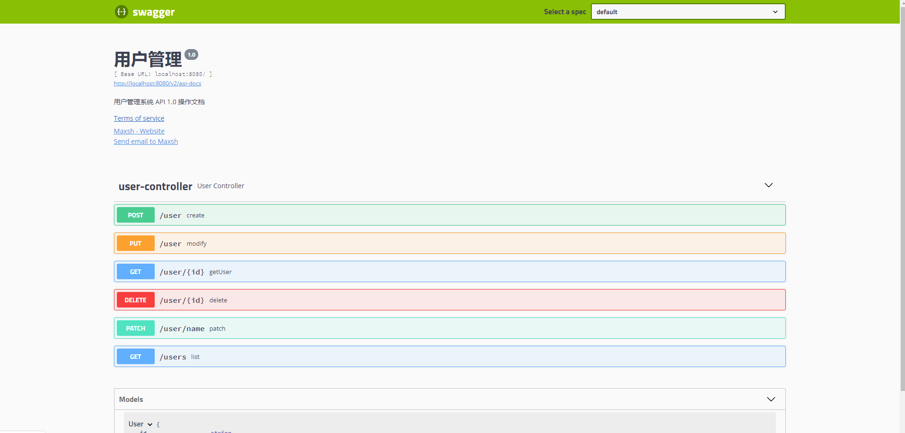

---

description: Swagger 2 构建API文档
---

# Springboot集成Swagger 2 构建API文档

## 什么是Swagger

Swagger UI允许任何人（无论您是开发团队还是最终用户）都可以可视化API资源并与之交互，而无需任何实现逻辑。它是根据您的OpenAPI（以前称为Swagger）规范自动生成的，具有可视化文档，可简化后端实现和客户端使用。 

> [官网介绍]( https://swagger.io/ )
>
> [Swagger-ui]( https://swagger.io/tools/swagger-ui/ )

## 添加依赖

```xml
<dependency>
    <groupId>io.springfox</groupId>
    <artifactId>springfox-swagger2</artifactId>
    <version>2.8.0</version>
</dependency>
<dependency>
    <groupId>io.springfox</groupId>
    <artifactId>springfox-swagger-ui</artifactId>
    <version>2.8.0</version>
</dependency>
```


## 创建Swagger配置类

项目中新建config包，新建 **SwaggerConfig** 配置类

```java
@Configuration
@EnableSwagger2
public class SwaggerConfig {
}
```

在spring中注册 Docket（Swagger API 摘要），其中 指定需要扫描的包路径，只有此路径下的 Controller 类才会自动生成 Swagger API 文档.apis(RequestHandlerSelectors.basePackage("com.maxsh.swagger.web"))。ApiInfo主要配置页面展示的基本信息包括，标题、描述、版本、服务条款、联系方式等， 


```java
@Bean
public Docket api() {
    return new Docket(DocumentationType.SWAGGER_2)
        .apiInfo(apiInfo())
        .select()
        // 自行修改为自己的包路径
        .apis(RequestHandlerSelectors.basePackage("com.maxsh.swagger.web"))
        .paths(PathSelectors.any())
        .build();
}

private ApiInfo apiInfo() {
    return new ApiInfoBuilder()
        .title("用户管理")
        .description("用户管理系统 API 1.0 操作文档")
        //服务条款网址
        .termsOfServiceUrl("http://www.maxsh.cn/")
        .version("1.0")
        .contact(new Contact("Maxsh", "http://www.maxsh.cn/", "869209045@qq.com"))
        .build();
}
```

 配置完成之后启动项目，在浏览器中输入网址 http://localhost:8080/swagger-ui.html， 即可看到swagger文档了。



## Swagger常用注解

Swagger默认配置没有具体的字段信息和ocntroller信息，可以通过一些注解表明该接口文档，包括接口名、请求方法、参数、返回信息等。

| 注解               | 作用范围           | 使用位置                           |
| ------------------ | ------------------ | ---------------------------------- |
| @Api               | 协议集描述         | 用于 Controller 类上               |
| @ApiOperation      | 协议描述           | 用在 Controller 的方法上           |
| @ApiImplicitParams | 非对象参数集       | 用在 Controller 的方法上           |
| @ApiImplicitParam  | 非对象参数描述     | 用在 @ApiImplicitParams 的方法里边 |
| @ApiResponses      | 响应集             | 用在 Controller 的方法上           |
| @ApiResponse       | 响应信息参数       | 用在 @ApiResponses 里边            |
| @ApiModel          | 描述返回对象的意义 | 用在返回对象类上                   |
| @ApiModelProperty  | 对象属性           | 用在出入参数对象的字段上           |


### @Api 的使用

| <div style="width:100px;">属性名称</div> | 备注                                             |
| ---------------------------------------- | ------------------------------------------------ |
| value                                    | url 的路径值                                     |
| tags                                     | 如果设置这个值，value 的值会被覆盖               |
| description（@Deprecated）               | 对 API 资源的描述                                |
| produces                                 | For example, "application/json, application/xml" |
| consumes                                 | For example, "application/json, application/xml" |
| protocols                                | Possible values: http, https, ws, wss            |
| authorizations                           | 高级特性认证时配置                               |
| hidden                                   | 配置为 true 将在文档中隐藏                       |

::: warning 注意

在swagger-annotations jar包中 1.5.X版本以上, 注解 io.swagger.annotations.API * 中的description被废弃了。新的swagger组件中使用了新的方法来对Web api 进行分组。原来使用 description ，默认一个Controller类中包含的方法构成一 个api分组。现在使用tag，可以更加方便的分组。比如把两个Controller类里的方法划分成同一个分组。tag的key用来区分不同的分组。tag的value用做分组的描述。

@ApiOperation 中value是api的简要说明，在界面api 链接的右侧，少于120个字符

@ApiOperation 中notes是api的详细说明，需要点开api 链接才能看到

@ApiOperation 中 produces 用来标记api返回值的具体类型

:::

所以调整SwaggerConfig类中的配置

```java
@Configuration
@EnableSwagger2
public class SwaggerConfig {
    @Bean
    public Docket api() {
        return new Docket(DocumentationType.SWAGGER_2)
                .apiInfo(apiInfo())
                .tags(new Tag("1-用户管理", "用户管理的API"), getTags())
                .select()
                // 自行修改为自己的包路径
                .apis(RequestHandlerSelectors.basePackage("com.maxsh.swagger.web"))
                .paths(PathSelectors.any())
                .build();
    }

    private Tag[] getTags() {
        Tag[] tags = {
                new Tag("2-消息管理", "消息管理的API"),
                new Tag("3-表格相关", "表格相关的API")
        };
        return tags;
    }

    private ApiInfo apiInfo() {
        return new ApiInfoBuilder()
                .title("用户管理")
                .description("用户管理系统 API 1.0 操作文档")
                //服务条款网址
                .termsOfServiceUrl("http://www.maxsh.cn/")
                .version("v 1.0")
                .contact(new Contact("Maxsh", "http://www.maxsh.cn/", "869209045@qq.com"))
                .build();
    }
}
```

@Api 作用在 Controller 类上，做为 Swagger 文档资源，该注解将一个 Controller标注为一个 Swagger 资源（API）。 在UserController上添加`@Api(tags={"1-用户管理"})`.


> [参考文章]( https://www.cnblogs.com/didispace/p/11639671.html )

### @ApiOperation 的使用

### @ApiImplicitParams 和 @ApiImplicitParam 的使用

### @ApiResponses 和 @ApiResponse 的使用

### @ApiModel 和 @ApiModelProperty 的使用