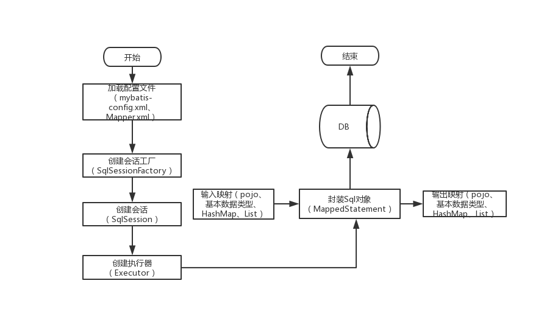

# SpringBoot集成Mybatis（基于XML配置）

MyBatis 是一款标准的 ORM 框架，被广泛的应用于各企业开发中。MyBatis 最早是 Apache 的一个开源项目 iBatis，2010 年这个项目由 Apache Software Foundation 迁移到了 Google Code，并且改名为 MyBatis，2013 年 11 月又迁移到 Github。

MyBatis 支持普通的 SQL 查询，存储过程和高级映射的优秀持久层框架。MyBatis 消除了几乎所有的 JDBC 代码和参数的手工设置以及对结果集的检索封装。MaBatis 可以使用简单的 XML 或注解用于配置和原始映射，将接口和 Java 的 POJO（Plain Old Java Objects，普通的 Java 对象）映射成数据库中的记录。

**优点**

- SQL 被统一提取出来，便于统一管理和优化
- SQL 和代码解耦，将业务逻辑和数据访问逻辑分离，使系统的设计更清晰、更易维护、更易单元测试
- 提供映射标签，支持对象与数据库的 ORM 字段关系映射
- 提供对象关系映射标签，支持对象关系组件维护
- 灵活书写动态 SQL，支持各种条件来动态生成不同的 SQL

**缺点**

- 编写 SQL 语句时工作量很大，尤其是字段多、关联表多时，更是如此
- SQL 语句依赖于数据库，导致数据库移植性差

## MyBatis 几个重要的概念

**`Mapper 配置`** 可以使用基于 XML 的 Mapper 配置文件来实现，也可以使用基于 Java 注解的 MyBatis 注解来实现，甚至可以直接使用 MyBatis 提供的 API 来实现。

**`Mapper 接口`**  是指自行定义的一个数据操作接口，类似于通常所说的 DAO 接口。早期的 Mapper 接口需要自定义去实现，现在 MyBatis 会自动为 Mapper 接口创建动态代理对象。Mapper 接口的方法通常与 Mapper 配置文件中的 select、insert、update、delete 等 XML 结点存在一一对应关系。

**`Executor`** MyBatis 中所有的 Mapper 语句的执行都是通过 Executor 进行的，Executor 是 MyBatis 的一个核心接口。

**`SqlSession`** 是MyBatis 的关键对象，是执行持久化操作的独享，类似于 JDBC 中的 Connection，SqlSession 对象完全包含以数据库为背景的所有执行 SQL 操作的方法，它的底层封装了 JDBC 连接，可以用 SqlSession 实例来直接执行被映射的 SQL 语句。

**`SqlSessionFactory`** 是 MyBatis 的关键对象，它是单个数据库映射关系经过编译后的内存镜像。SqlSessionFactory 对象的实例可以通过 SqlSessionFactoryBuilder 对象类获得，而 SqlSessionFactoryBuilder 则可以从 XML 配置文件或一个预先定制的 Configuration 的实例构建出。

MyBatis 的`工作流程`如下：



- 首先加载 Mapper 配置的 SQL 映射文件，或者是注解的相关 SQL 内容。
- 创建会话工厂，MyBatis 通过读取配置文件的信息来构造出会话工厂（SqlSessionFactory）。
- 创建会话。根据会话工厂，MyBatis 就可以通过它来创建会话对象（SqlSession），会话对象是一个接口，该接口中包含了对数据库操作的增、删、改、查方法。
- 创建执行器。因为会话对象本身不能直接操作数据库，所以它使用了一个叫做数据库执行器（Executor）的接口来帮它执行操作。
- 封装 SQL 对象。在这一步，执行器将待处理的 SQL 信息封装到一个对象中（MappedStatement），该对象包括 SQL 语句、输入参数映射信息（Java 简单类型、HashMap 或 POJO）和输出结果映射信息（Java 简单类型、HashMap 或 POJO）。
- 操作数据库。拥有了执行器和 SQL 信息封装对象就使用它们访问数据库了，最后再返回操作结果，结束流程。

## 演示案例

使用`start.spring.io`生成项目时勾选web，mysql和mybatis依赖生成项目。数据库还是用test库的user。

application.properties 添加相关配置：

```properties
mybatis.config-location=classpath:mybatis/mybatis-config.xml
mybatis.mapper-locations=classpath:mybatis/mapper/*.xml
mybatis.type-aliases-package=com.maxsh.model

spring.datasource.url=jdbc:mysql://localhost:3306/test?serverTimezone=UTC&useUnicode=true&characterEncoding=utf-8&useSSL=true
spring.datasource.username=root
spring.datasource.password=123456
spring.datasource.driver-class-name=com.mysql.cj.jdbc.Driver
```

在启动类中添加对 Mapper 包扫描 @MapperScan，Spring Boot 启动的时候会自动加载包路径下的 Mapper。

或者直接在 Mapper 类上面添加注解 @Mapper。

```java
@SpringBootApplication
@MapperScan("com.maxsh.mapper")
public class MybatisXmlApplication {
    public static void main(String[] args) {
        SpringApplication.run(MybatisXmlApplication.class, args);
    }
}
```

mybatis-config.xml 主要配置常用的 typeAliases，设置类型别名，为 Java 类型设置一个短的名字。这样我们在使用 Mapper.xml 的时候，需要引入可以直接写别名而不用写全名。

```xml
<?xml version="1.0" encoding="UTF-8" ?>
<!DOCTYPE configuration PUBLIC "-//mybatis.org//DTD Config 3.0//EN" "http://mybatis.org/dtd/mybatis-3-config.dtd">
<configuration>
    <typeAliases>
        <typeAlias alias="Integer" type="java.lang.Integer" />
        <typeAlias alias="Long" type="java.lang.Long" />
        <typeAlias alias="HashMap" type="java.util.HashMap" />
        <typeAlias alias="LinkedHashMap" type="java.util.LinkedHashMap" />
        <typeAlias alias="ArrayList" type="java.util.ArrayList" />
        <typeAlias alias="LinkedList" type="java.util.LinkedList" />
    </typeAliases>
</configuration>
```

添加User 的映射文件UserMapper.xml

```xml
<?xml version="1.0" encoding="UTF-8" ?>
<!DOCTYPE mapper PUBLIC "-//mybatis.org//DTD Mapper 3.0//EN" "http://mybatis.org/dtd/mybatis-3-mapper.dtd" >
<mapper namespace="com.maxsh.mapper.UserMapper" >
    <resultMap id="BaseResultMap" type="com.maxsh.model.User" >
        <id column="id" property="id" jdbcType="BIGINT" />
        <result column="name" property="name" jdbcType="VARCHAR" />
        <result column="password" property="password" jdbcType="VARCHAR" />
        <result column="sex" property="sex" javaType="com.maxsh.enums.UserSexEnum"/>
        <result column="age" property="age" jdbcType="INTEGER" />
    </resultMap>

    <sql id="Base_Column_List" >
        id, name, password, sex, age
    </sql>

    <sql id="Base_Where_List">
        <if test="name != null  and name != ''">
            and name = #{name}
        </if>
        <if test="sex != null and sex != ''">
            and sex = #{sex}
        </if>
    </sql>

    <select id="getAll" resultMap="BaseResultMap"  >
        SELECT
        <include refid="Base_Column_List" />
        FROM user
    </select>

    <select id="getList" resultMap="BaseResultMap" parameterType="com.maxsh.param.UserParam">
        select
        <include refid="Base_Column_List" />
        from user
        where 1=1
        <include refid="Base_Where_List" />
        order by id desc
        limit #{beginLine} , #{pageSize}
    </select>

    <select id="getCount" resultType="Integer" parameterType="com.maxsh.param.UserParam">
        select
        count(1)
        from user
        where 1=1
        <include refid="Base_Where_List" />
    </select>

    <select id="getOne" parameterType="Long" resultMap="BaseResultMap" >
        SELECT
        <include refid="Base_Column_List" />
        FROM user
        WHERE id = #{id}
    </select>

    <insert id="insert" parameterType="com.maxsh.model.User" >
       INSERT INTO
       		user
       		(name,password,sex,age)
       	VALUES
       		(#{name}, #{password}, #{sex}, #{age})
    </insert>

    <update id="update" parameterType="com.maxsh.model.User" >
        UPDATE
        user
        SET
        <if test="name != null">name = #{name},</if>
        <if test="password != null">password = #{password},</if>
        age = #{age}
        WHERE
        id = #{id}
    </update>

    <delete id="delete" parameterType="Long" >
       DELETE FROM
       		 user
       WHERE
       		 id =#{id}
    </delete>

</mapper>
```

编写`<mapper namespace="com.maxsh.mapper.UserMapper" >`中定义的Mapper接口，也就是Dao层代码

```java
public interface UserMapper {
    List<User> getAll();

    List<User> getList(UserParam userParam);

    int getCount(UserParam userParam);

    User getOne(Long id);

    void insert(User user);

    int update(User user);

    int delete(Long id);
}
```

:::  danger 注意 
 这里的方法名需要和 XML 配置中的 id 属性一致，不然会找不到方法去对应执行的 SQL。
:::


在Test类中注入UserMapper进行测试

```java
@Resource
private UserMapper userMapper;

@Test
@DisplayName("测试User增删改查")
public void testUser()  {
    User user = new User();
    user.setName("张三");
    user.setPassword("zs234");
    user.setAge(18);
    user.setSex(UserSexEnum.MAN);
    //增加
    userMapper.insert(user);
    //删除
    int  count =userMapper.delete(2l);
    User user1  = userMapper.getOne(5l);
    //修改
    userMapper.update(user1);
    //查询
    List<User> users = userMapper.getAll();
}
```

