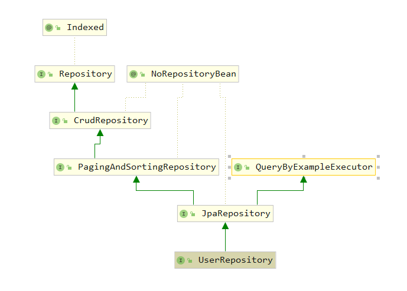

---


description: Spring Data JPA的使用


---

# Spring Data JPA的使用

JPA（Java Persistence API）是 Sun 官方提出的 Java 持久化规范。它为 Java 开发人员提供了一种对象 / 关联映射工具来管理 Java 应用中的关系数据。

::: tip 注意

JPA 是一套规范，不是一套产品，那么像 Hibernate、TopLink、JDO 它们是一套产品，如果说这些产品实现了这个 JPA 规范，那么我们就可以称他们为 JPA 的实现产品。

:::

Spring Data JPA 是 Spring 基于 ORM 框架、JPA 规范的基础上封装的一套 JPA 应用框架，可以让开发者用极简的代码即可实现对数据的访问和操作。它提供了包括增、删、改、查等在内的常用功能，且易于扩展，学习并使用 Spring Data JPA 可以极大提高开发效率。Spring Data JPA 其实就是 Spring 基于 Hibernate 之上构建的 JPA 使用解决方案，方便在 Spring Boot 项目中使用 JPA 技术。

## 基本使用

### 添加依赖

```xml
<dependency>
    <groupId>org.springframework.boot</groupId>
    <artifactId>spring-boot-starter-data-jpa</artifactId>
</dependency>
<dependency>
    <groupId>mysql</groupId>
    <artifactId>mysql-connector-java</artifactId>
    <scope>runtime</scope>
</dependency>
```

### 添加配置文件

```properties
spring.datasource.url=jdbc:mysql://localhost:3306/test?serverTimezone=UTC&useUnicode=true&characterEncoding=utf-8&useSSL=true
spring.datasource.username=root
spring.datasource.password=123456
spring.datasource.driver-class-name=com.mysql.cj.jdbc.Driver

spring.jpa.properties.hibernate.hbm2ddl.auto=create
spring.jpa.properties.hibernate.dialect=org.hibernate.dialect.MySQL5InnoDBDialect
#SQL 输出
spring.jpa.show-sql=true
#format 一下 SQL 进行输出
spring.jpa.properties.hibernate.format_sql=true
```

hibernate.hbm2ddl.auto 参数的作用主要用于：自动创建、更新、验证数据库表结构，有四个值。

- create：每次加载 Hibernate 时都会删除上一次生成的表，然后根据 model 类再重新来生成新表，哪怕两次没有任何改变也要这样执行，这就是导致数据库表数据丢失的一个重要原因。
- create-drop：每次加载 Hibernate 时根据 model 类生成表，但是 sessionFactory 一关闭，表就自动删除。
- update：最常用的属性，第一次加载 Hibernate 时根据 model 类会自动建立起表的结构（前提是先建立好数据库），以后加载 Hibernate 时根据 model 类自动更新表结构，即使表结构改变了，但表中的行仍然存在，不会删除以前的行。要注意的是当部署到服务器后，表结构是不会被马上建立起来的，是要等应用第一次运行起来后才会。
- validate ：每次加载 Hibernate 时，验证创建数据库表结构，只会和数据库中的表进行比较，不会创建新表，但是会插入新值。

### 新建实体类

```java
@Entity
@Table(name = "user")
public class UserEntity {
    @Id
    @GeneratedValue
    private Long id;
    @Column(nullable = false, unique = true)
    private String userName;
    @Column(nullable = false)
    private String password;
    @Column(nullable = false, unique = true)
    private String email;
    @Column(nullable = true, unique = true)
    private String nickName;
    @Column(nullable = true, unique = true)
    private String age;
    @Column(nullable = false)
    private String regTime;

    public Long getId() {
        return id;
    }

    public void setId(Long id) {
        this.id = id;
    }

    public String getUserName() {
        return userName;
    }

    public void setUserName(String userName) {
        this.userName = userName;
    }

    public String getPassword() {
        return password;
    }

    public void setPassword(String password) {
        this.password = password;
    }

    public String getEmail() {
        return email;
    }

    public void setEmail(String email) {
        this.email = email;
    }

    public String getNickName() {
        return nickName;
    }

    public void setNickName(String nickName) {
        this.nickName = nickName;
    }

    public String getAge() {
        return age;
    }

    public void setAge(String age) {
        this.age = age;
    }

    public String getRegTime() {
        return regTime;
    }

    public void setRegTime(String regTime) {
        this.regTime = regTime;
    }
}
```

- `@Entity(name="EntityName")` 必须，用来标注一个数据库对应的实体，数据库中创建的表名默认和类名一致。其中，name 为可选，对应数据库中一个表，使用此注解标记 Pojo 是一个 JPA 实体。
- `@Table(name=""，catalog=""，schema="")` 可选，用来标注一个数据库对应的实体，数据库中创建的表名默认和类名一致。通常和 @Entity 配合使用，只能标注在实体的 class 定义处，表示实体对应的数据库表的信息。
- `@Id` 必须，@Id 定义了映射到数据库表的主键的属性，一个实体只能有一个属性被映射为主键。
- `@GeneratedValue(strategy=GenerationType，generator="")` 可选，strategy: 表示主键生成策略，有 AUTO、INDENTITY、SEQUENCE 和 TABLE 4 种，分别表示让 ORM 框架自动选择，generator: 表示主键生成器的名称。
- `@Column(name = "user_code"， nullable = false， length=32)` 可选，@Column 描述了数据库表中该字段的详细定义，这对于根据 JPA 注解生成数据库表结构的工具。name: 表示数据库表中该字段的名称，默认情形属性名称一致；nullable: 表示该字段是否允许为 null，默认为 true；unique: 表示该字段是否是唯一标识，默认为 false；length: 表示该字段的大小，仅对 String 类型的字段有效。
- `@Transient`可选，@Transient 表示该属性并非一个到数据库表的字段的映射，ORM 框架将忽略该属性。
- `@Enumerated` 可选，使用枚举的时候，我们希望数据库中存储的是枚举对应的 String 类型，而不是枚举的索引值，需要在属性上面添加 @Enumerated(EnumType.STRING) 注解。

### 创建Repository

创建的 Repository 只要继承 JpaRepository 即可，就会帮我们自动生成很多内置方法。另外还有一个功能非常实用，可以根据方法名自动生产 SQL，比如 findByUserName 会自动生产一个以 userName 为参数的查询方法，比如 findAll 会自动查询表里面的所有数据等。

```java
public interface UserRepository extends JpaRepository<UserEntity, Long> {
    UserEntity findByUserName(String userName);
    UserEntity findByUserNameOrEmail(String username,String email);
}
```

查看类图我们发现 JpaRepository 继承 PagingAndSortingRepository 和 QueryByExampleExecutor，PagingAndSortingRepository 类主要负责排序和分页内容，QueryByExampleExecutor 提供了很多示例的查询方法，CrudRepository 内置了我们最常用的增、删、改、查的方法，因此使用 JPA 操作数据库时，只需要构建的 Repository 继承了 JpaRepository，就会拥有了很多常用的数据库操作方法。



### 测试一下

```java
 @Resource
    private UserRepository userRepository;

    @Test
    @DisplayName("增删改查")
    void testJpa() {
        Date       date          = new Date();
        DateFormat dateFormat    = DateFormat.getDateTimeInstance(DateFormat.LONG,DateFormat.LONG);
        String     formattedDate = dateFormat.format(date);
        userRepository.save(new UserEntity("aa","aa123456","aa@126.com","aa", "18",formattedDate));
        userRepository.save(new UserEntity("bb","bb123456","bb@126.com","bb","18",formattedDate));
        userRepository.save(new UserEntity("cc","cc123456","cc@126.com","cc","18",formattedDate));

        userRepository.delete(userRepository.findByUserName("cc"));
        UserEntity userb = new UserEntity("bb","sdf","bb@126.com","bb","18",formattedDate);
        userb.setId(2L);
        userRepository.save(userb);

        List<UserEntity> list = userRepository.findAll();
        System.out.println(list);

        Assertions.assertThat("2").isEqualTo(list.size());
        Assertions.assertThat("bb").isEqualTo(userRepository.findByUserNameOrEmail("bb","cc@126.com").getNickName());
    }
```

### 基本查询

我们可以将 Spring Data JPA 查询分为两种，一种是 Spring Data JPA 默认实现的，另一种是需要根据查询的情况来自行构建。

#### 预生成方法

预生成方法就是我们上面看到的那些方法，因为继承了 JpaRepository 而拥有了父类的这些内容。

#### 自定义查询

Spring Data JPA 可以根据接口方法名来实现数据库操作，主要的语法是 findXXBy、readAXXBy、queryXXBy、countXXBy、getXXBy 后面跟属性名称，利用这个功能仅需要在定义的 Repository 中添加对应的方法名即可，使用时 Spring Boot 会自动帮我们实现，示例如下。

根据用户名查询用户：

```java
UserEntity findByUserName(String userName);
```

也可以加一些关键字 And、or：

```java
UserEntity findByUserNameOrEmail(String username,String email);
```

修改、删除、统计也是类似语法：

```java
Long deleteById(Long id);
Long countByUserName(String userName)
```

基本上 SQL 体系中的关键词都可以使用，如 LIKE 、IgnoreCase、OrderBy：

```java
List<UserEntity> findByEmailLike(String email);

UserEntity findByUserNameIgnoreCase(String userName);

List<UserEntity> findByUserNameOrderByEmailDesc(String email);
```

**具体的关键字，使用方法和生产成 SQL 如下表所示**

| Keyword            | Sample                                   | JPQL snippet                                                 |
| ------------------ | ---------------------------------------- | ------------------------------------------------------------ |
| And                | findByLastnameAndFirstname               | … where x.lastname = ?1 and x.firstname = ?2                 |
| Or                 | findByLastnameOrFirstname                | … where x.lastname = ?1 or x.firstname = ?2                  |
| Is，Equals         | findByFirstnameIs，findByFirstnameEquals | … where x.firstname = ?1                                     |
| Between            | findByStartDateBetween                   | … where x.startDate between ?1 and ?2                        |
| LessThan           | findByAgeLessThan                        | … where x.age < ?1                                           |
| LessThanEqual      | findByAgeLessThanEqual                   | … where x.age ⇐ ?1                                           |
| GreaterThan        | findByAgeGreaterThan                     | … where x.age > ?1                                           |
| GreaterThanEqual   | findByAgeGreaterThanEqual                | … where x.age >= ?1                                          |
| After              | findByStartDateAfter                     | … where x.startDate > ?1                                     |
| Before             | findByStartDateBefore                    | … where x.startDate < ?1                                     |
| IsNull             | findByAgeIsNull                          | … where x.age is null                                        |
| IsNotNull，NotNull | findByAge(Is)NotNull                     | … where x.age not null                                       |
| Like               | findByFirstnameLike                      | … where x.firstname like ?1                                  |
| NotLike            | findByFirstnameNotLike                   | … where x.firstname not like ?1                              |
| StartingWith       | findByFirstnameStartingWith              | … where x.firstname like ?1 (parameter bound with appended %) |
| EndingWith         | findByFirstnameEndingWith                | … where x.firstname like ?1 (parameter bound with prepended %) |
| Containing         | findByFirstnameContaining                | … where x.firstname like ?1 (parameter bound wrapped in %)   |
| OrderBy            | findByAgeOrderByLastnameDesc             | … where x.age = ?1 order by x.lastname desc                  |
| Not                | findByLastnameNot                        | … where x.lastname <> ?1                                     |
| In                 | findByAgeIn(Collection ages)             | … where x.age in ?1                                          |
| NotIn              | findByAgeNotIn(Collection age)           | … where x.age not in ?1                                      |
| TRUE               | findByActiveTrue()                       | … where x.active = true                                      |
| FALSE              | findByActiveFalse()                      | … where x.active = false                                     |
| IgnoreCase         | findByFirstnameIgnoreCase                | … where UPPER(x.firstame) = UPPER(?1)                        |


## 高级用法

### 自定义 SQL 查询

- 在 SQL 的查询方法上面使用 @Query 注解，在注解内写 Hql 来查询内容。

```java
@Query("select u from UserEntity u")
Page<UserEntity> findALL(Pageable pageable);
```

- 当然如果感觉使用原生 SQL 更习惯，它也是支持的，需要再添加一个参数 nativeQuery = true。

```java
@Query(value="select u.* from user u where u.nick_name = ?1", nativeQuery = true)
Page<UserEntity> findByNickName(String nickName, Pageable pageable);
```

- @Query 上面的 1 代表的是方法参数里面的顺序，如果有多个参数也可以按照这个方式添加 1、2、3....。除了按照这种方式传参外，还可以使用 @Param 来支持。

```java
@Query(value="select u.* from user u where u.nick_name = :nickName", nativeQuery = true)
Page<UserEntity> findByNickName2(@Param("nickName") String nickName, Pageable pageable);
```

- 如涉及到删除和修改需要加上 @Modifying，也可以根据需要添加 @Transactional 对事务的支持、操作超时设置等。

```java
@Transactional(timeout = 10)
@Modifying
@Query("update UserEntity set userName = ?1 where id = ?2")
int modifyById(String  userName, Long id);

@Transactional
@Modifying
@Query("delete from UserEntity where id = ?1")
void deleteByUserId(Long id);
```

### 使用已命名的查询

除了使用 @Query 注解外，还可以预先定义好一些查询，并为其命名，然后再 Repository 中添加相同命名的方法。

```java
@Entity
@Table(name = "user")
@NamedQueries({
        @NamedQuery(name = "UserEntity.findByPassWord", query = "select u from UserEntity u where u.passWord = ?1"),
        @NamedQuery(name = "UserEntity.findByNickName", query = "select u from UserEntity u where u.nickName = ?1"),
})
public class UserEntity implements Serializable{
	...
}
```

通过 @NamedQueries 注解可以定义多个命名 Query，@NamedQuery 的 name 属性定义了 Query 的名称，注意加上 Entity 名称 . 作为前缀，query 属性定义查询语句。然后在UserRepository中添加对应的方法。

```java
List<UserEntity> findByPassWord(String passWord);
List<UserEntity> findByNickName(String nickName);
```


### Query 的查找策略

查询方法有三种方式：

1. 通过方法名自动创建 Query
2. 通过 @Query 注解实现自定义 Query
3. 通过 @NamedQuery 注解来定义 Query

可以通过配置 @EnableJpaRepositories 的 queryLookupStrategy 属性来配置 Query 查找策略：

- CREATE：尝试从查询方法名构造特定于存储的查询。一般的方法是从方法名中删除一组已知的前缀，并解析方法的其余部分。
- USE_DECLARED_QUERY：尝试查找已声明的查询，如果找不到，则抛出异常。查询可以通过某个地方的注释定义，也可以通过其他方式声明。
- CREATE_IF_NOT_FOUND（默认）：CREATE 和 USE_DECLARED_QUERY 的组合，它首先查找一个已声明的查询，如果没有找到已声明的查询，它将创建一个自定义方法基于名称的查询。它允许通过方法名进行快速查询定义，还可以根据需要引入声明的查询来定制这些查询调优。

一般情况下使用默认配置即可，如果确定项目 Query 的具体定义方式，可以更改上述配置，例如，全部使用 @Query 来定义查询，又或者全部使用命名的查询。


### 限制查询

有时候我们只需要查询前 N 个元素，或者只取前一个实体。

```java
UserEntity findFirstByOrderByNickNameAsc();

UserEntity findTopByOrderByAgeDesc();

Page<UserEntity> queryFirst10ByNickName(String nickName, Pageable pageable);

List<UserEntity> findFirst10ByNickName(String nickName, Sort sort);

List<UserEntity> findTop10ByNickName(String nickName, Pageable pageable);
```

### 复杂查询

一般可以通过 AND 或者 OR 等连接词来不断拼接属性来构建多条件查询，但如果参数大于 6 个时，方法名就会变得非常的长，并且还不能解决动态多条件查询的场景。JpaSpecificationExecutor 是 JPA 2.0 提供的 Criteria API 的使用封装，可以用于动态生成 Query 来满足我们业务中的各种复杂场景。Spring Data JPA 提供了 JpaSpecificationExecutor 接口，只要简单实现 toPredicate 方法就可以实现复杂的查询。

JpaSpecificationExecutor 的源码很简单，根据 Specification 的查询条件返回 List、Page 或者 count 数据。在使用 JpaSpecificationExecutor 构建复杂查询场景之前，我们需要了解几个概念：

- Root\<T\> root，代表了可以查询和操作的实体对象的根，通过 get("属性名") 来获取对应的值。
- CriteriaQuery query，代表一个 specific 的顶层查询对象，它包含着查询的各个部分，比如 select 、from、where、group by、order by 等。
- CriteriaBuilder cb，来构建 CritiaQuery 的构建器对象，其实就相当于条件或者是条件组合，并以 Predicate 的形式返回。

新建一个UserDetail类。

```java
@Entity
@Table(name = "user_detail")
public class UserDetailEntity {
    @Id
    @GeneratedValue
    private Long id;
    @Column(nullable = false, unique = true)
    private Long userId;
    private Integer age;
    private String realName;
    private String status;
    private String hobby;
    private String introduction;
    private String lastLoginIp;

	......
}
```


创建 UserDetail 对应的 Repository

```java
public interface UserDetailRepository extends JpaRepository<UserDetailEntity, Long>,
        JpaSpecificationExecutor<UserDetailEntity> {
}
```

定义一个查询 `Page<UserDetailEntity>` 的接口：

```java
public interface UserDetailService {
    public Page<UserDetailEntity> findByCondition(UserDetailParam detailParam, Pageable pageable);
}
```

```java
@Service
public class UserDetailServiceImpl implements UserDetailService{

    @Resource
    private UserDetailRepository userDetailRepository;

    @Override
    public Page<UserDetailEntity> findByCondition(UserDetailParam detailParam, Pageable pageable) {

        return userDetailRepository.findAll((root, query, cb) -> {
            List<Predicate> predicates = new ArrayList<Predicate>();
            //equal 示例
            if (!StringUtils.isNullOrEmpty(detailParam.getIntroduction())){
                predicates.add(cb.equal(root.get("introduction"), detailParam.getIntroduction()));
            }
            //like 示例
            if (!StringUtils.isNullOrEmpty(detailParam.getRealName())){
                predicates.add(cb.like(root.get("realName"),"%"+detailParam.getRealName()+"%"));
            }
            //between 示例
            if (detailParam.getMinAge()!=null && detailParam.getMaxAge()!=null) {
                Predicate agePredicate = cb.between(root.get("age"), detailParam.getMinAge(), detailParam.getMaxAge());
                predicates.add(agePredicate);
            }
            //greaterThan 大于等于示例
            if (detailParam.getMinAge()!=null){
                predicates.add(cb.greaterThan(root.get("age"),detailParam.getMinAge()));
            }
            return query.where(predicates.toArray(new Predicate[predicates.size()])).getRestriction();
        }, pageable);
    }
}
```

### 多表查询返回自定义实体

新建自定义返回实体UserInfo

```java
public class UserInfo {
    private String userName;
    private String email;
    private String introduction;
    private String hobby;

    public UserInfo() {
    }

    public UserInfo(String userName, String email, String introduction, String hobby) {
        this.userName = userName;
        this.email = email;
        this.introduction = introduction;
        this.hobby = hobby;
    }

    public String getUserName() {
        return userName;
    }

    public void setUserName(String userName) {
        this.userName = userName;
    }

    public String getEmail() {
        return email;
    }

    public void setEmail(String email) {
        this.email = email;
    }

    public String getIntroduction() {
        return introduction;
    }

    public void setIntroduction(String introduction) {
        this.introduction = introduction;
    }

    public String getHobby() {
        return hobby;
    }

    public void setHobby(String hobby) {
        this.hobby = hobby;
    }

    @Override
    public String toString() {
        return new StringJoiner(", ", UserInfo.class.getSimpleName() + "[", "]")
                .add("userName='" + userName + "'")
                .add("email='" + email + "'")
                .add("introduction='" + introduction + "'")
                .add("hobby='" + hobby + "'")
                .toString();
    }
}
```

1.  使用select new +对象全类名 的语法，此处的UserEntity,  UserDetailEntity为EntityManager 管理的实体，UserInfo为自定义的实体。

​       在 UserDetailRepository 中添加查询的方法，返回类型设置为 UserInfo：

```java
@Query("select new com.maxsh.param.UserInfo(u.userName, u.email, d.introduction ,d.hobby) " +"from UserEntity u , UserDetailEntity d " + "where u.id=d.userId  and  d.hobby = ?1 ")
List<UserInfo> findUserInfo(String hobby);
```

2. 定义一个结果集的接口类，接口类的内容来自于用户表和用户详情表。

```java
public interface UserDTO {
    String getUserName();
    String getEmail();
    String getAddress();
    String getHobby();
}
```

::: danger 说明

在运行中 Spring 会给接口（UserInfo）自动生产一个代理类来接收返回的结果，代码中使用 getXX 的形式来获取。

:::


## 多数据源的用法