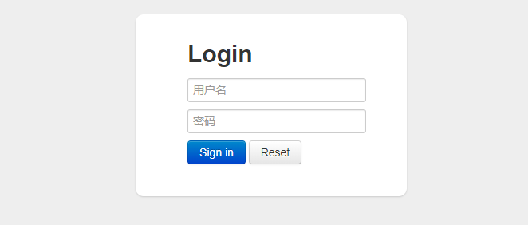
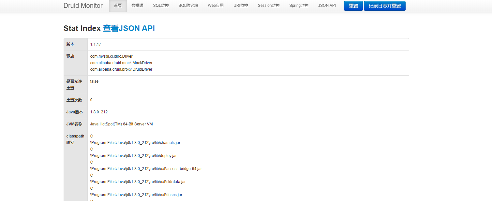

---


description: Spring Boot 集成 Druid 监控数据源


---

# Spring Boot 集成 Druid 监控数据源

## Druid 是什么

Druid 是 Java 语言中的数据库连接池，Druid 能够提供强大的监控和扩展功能。

- 替换其他 Java 连接池，Druid 提供了一个高效、功能强大、可扩展性好的数据库连接池。

- 可以监控数据库访问性能， Druid 内置提供了一个功能强大的StatFilter插件，能够详细统计 SQL 的执行性能，这对于线上分析数据库访问性能有帮助。

- 数据库密码加密。直接把数据库密码写在配置文件中，这是不好的行为，容易导致安全问题。 DruidDruiver 和 DruidDataSource 都支持 PasswordCallback 。

- SQL 执行日志， Druid 提供了不同的 LogFilter ，能够支持 Common-Logging 、 Log4j 和 JdkLog ，你可以按需要选择相应的 LogFilter ，监控你应用的数据库访问情况。

- 扩展 JDBC ，如果你要对 JDBC 层有编程的需求，可以通过 Druid 提供的 Filter 机制，很方便编写 JDBC 层的扩展插件。

## Spring Boot 中如何使用

目前 Druid 官方为我们提供了两种使用依赖方式，一种是基于传统 Java 工程提供的依赖包

```xml
<dependency>
    <groupId>com.alibaba</groupId>
    <artifactId>druid</artifactId>
    <version>1.1.20</version>
</dependency>
```

还有一种是基于 Spring Boot 提供的依赖包

```xml
<dependency>
    <groupId>com.alibaba</groupId>
    <artifactId>druid-spring-boot-starter</artifactId>
    <version>1.1.20</version>
</dependency>
```

下面的这种依赖包除了包含了上面的那种 Druid 基础包，还包含了 Spring Boot 自动配置的依赖包以及 sl4j-api ，我们在 Spring Boot 中使用 Druid ,当然是使用第二种方式引入依赖。

## 工程实战

### 创建工程druid

pom.xml 如下

```xml
<?xml version="1.0" encoding="UTF-8"?>
<project xmlns="http://maven.apache.org/POM/4.0.0"
         xmlns:xsi="http://www.w3.org/2001/XMLSchema-instance"
         xsi:schemaLocation="http://maven.apache.org/POM/4.0.0 http://maven.apache.org/xsd/maven-4.0.0.xsd">
    <modelVersion>4.0.0</modelVersion>
    <parent>
        <groupId>org.springframework.boot</groupId>
        <artifactId>spring-boot-starter-parent</artifactId>
        <version>2.2.2.RELEASE</version>
        <relativePath/> <!-- lookup parent from repository -->
    </parent>
    <groupId>com.maxsh</groupId>
    <artifactId>durid</artifactId>
    <version>1.0-SNAPSHOT</version>

    <properties>
        <java.version>1.8</java.version>
        <druid.version>1.1.20</druid.version>
    </properties>

    <dependencies>
        <dependency>
            <groupId>org.springframework.boot</groupId>
            <artifactId>spring-boot-starter-data-jpa</artifactId>
        </dependency>
        <dependency>
            <groupId>org.springframework.boot</groupId>
            <artifactId>spring-boot-starter-web</artifactId>
        </dependency>

        <dependency>
            <groupId>mysql</groupId>
            <artifactId>mysql-connector-java</artifactId>
            <scope>runtime</scope>
        </dependency>
        <dependency>
            <groupId>com.alibaba</groupId>
            <artifactId>druid-spring-boot-starter</artifactId>
            <version>${druid.version}</version>
        </dependency>
        <dependency>
            <groupId>org.projectlombok</groupId>
            <artifactId>lombok</artifactId>
            <optional>true</optional>
        </dependency>
        <dependency>
            <groupId>org.springframework.boot</groupId>
            <artifactId>spring-boot-starter-test</artifactId>
            <scope>test</scope>
            <exclusions>
                <exclusion>
                    <groupId>org.junit.vintage</groupId>
                    <artifactId>junit-vintage-engine</artifactId>
                </exclusion>
            </exclusions>
        </dependency>
    </dependencies>

    <build>
        <plugins>
            <plugin>
                <groupId>org.springframework.boot</groupId>
                <artifactId>spring-boot-maven-plugin</artifactId>
            </plugin>
        </plugins>
    </build>

</project>
```

### application 配置

```yaml
server:
  port: 8080
spring:
  application:
    name: druid
  profiles:
    active: pass
  jpa:
    database: mysql
    show-sql: true
    generate-ddl: true
    database-platform: org.hibernate.dialect.MySQL5InnoDBDialect
    hibernate:
      ddl-auto: update
    properties:
      hibernate:
        format_sql: true
```

### 数据库密码不加密的配置文件

```yaml
spring:
  datasource:
    type: com.alibaba.druid.pool.DruidDataSource
    url: jdbc:mysql://localhost:3306/test?serverTimezone=Asia/Shanghai&useUnicode=true&characterEncoding=UTF-8&useSSL=false
    username: root
    password: 123456
    driverClassName: com.mysql.cj.jdbc.Driver
    druid:
      # 连接池的配置信息
      # 初始化时建立物理连接的个数
      initial-size: 3
      # 连接池最小连接数
      min-idle: 3
      # 连接池最大连接数
      max-active: 20
      # 获取连接时最大等待时间，单位毫秒
      max-wait: 60000
      # 申请连接的时候检测，如果空闲时间大于timeBetweenEvictionRunsMillis，执行validationQuery检测连接是否有效。
      test-while-idle: true
      # 既作为检测的间隔时间又作为testWhileIdel执行的依据
      time-between-connect-error-millis: 60000
      # 销毁线程时检测当前连接的最后活动时间和当前时间差大于该值时，关闭当前连接
      min-evictable-idle-time-millis: 30000
      # 用来检测连接是否有效的sql 必须是一个查询语句
      # mysql中为 select 'x'
      # oracle中为 select 1 from dual
      validation-query: select 'x'
      # 申请连接时会执行validationQuery检测连接是否有效,开启会降低性能,默认为true
      test-on-borrow: false
      # 归还连接时会执行validationQuery检测连接是否有效,开启会降低性能,默认为true
      test-on-return: false
      # 是否缓存preparedStatement,mysql5.5+建议开启
      pool-prepared-statements: true
      # 当值大于0时poolPreparedStatements会自动修改为true
      max-pool-prepared-statement-per-connection-size: 20
      # 合并多个DruidDataSource的监控数据
      use-global-data-source-stat: false
      # 配置扩展插件
      filters: stat,wall,slf4j
      # 通过connectProperties属性来打开mergeSql功能；慢SQL记录
      connect-properties: druid.stat.mergeSql=true;druid.stat.slowSqlMillis=5000
      # 定时输出统计信息到日志中，并每次输出日志会导致清零（reset）连接池相关的计数器。
      time-between-log-stats-millis: 300000
      # 配置DruidStatFilter
      web-stat-filter:
        enabled: true
        url-pattern: '/*'
        exclusions: '*.js,*.gif,*.jpg,*.bmp,*.png,*.css,*.ico,/druid/*'
      # 配置DruidStatViewServlet
      stat-view-servlet:
        # 是否启用StatViewServlet（监控页面）默认值为false（考虑到安全问题默认并未启动，如需启用建议设置密码或白名单以保障安全）
        enabled: true
        url-pattern: '/druid/*'
        # IP白名单(没有配置或者为空，则允许所有访问)
        allow: 127.0.0.1,192.168.0.1
        # IP黑名单 (存在共同时，deny优先于allow)
        deny: 192.168.0.128
        # 禁用HTML页面上的“Reset All”功能
        reset-enable: false
        # 登录名
        login-username: admin
        # 登录密码
        login-password: admin
```


### 数据库密码加密的配置文件

在生产环境中，直接在配置文件中暴露明文密码是一件非常危险的事情，出于两点考虑：对外，即使应用服务被入侵，数据库还是安全的；对内，生产环境的数据库密码理论上应该只有 dba 知道，但是代码都是在代码仓库中放着的，如果密码没有加密，每次发布前 dba 都需要手动修改配置文件后再进行打包编译。

首先，我们需要通过com.alibaba.druid.filter.config.ConfigTools生成数据库密码的密文。

```
java -cp druid-1.1.10.jar com.alibaba.druid.filter.config.ConfigTools 123456
```

配置完成后，直接启动项目访问地址：http://localhost:8080/druid，就会出现 Druid 监控后台的登录页面



输入账户和密码后，就会进入首页，首页会展示项目使用的 JDK 版本、数据库驱动、JVM 相关统计信息。

