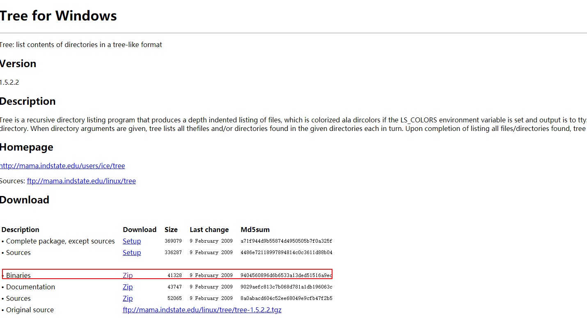
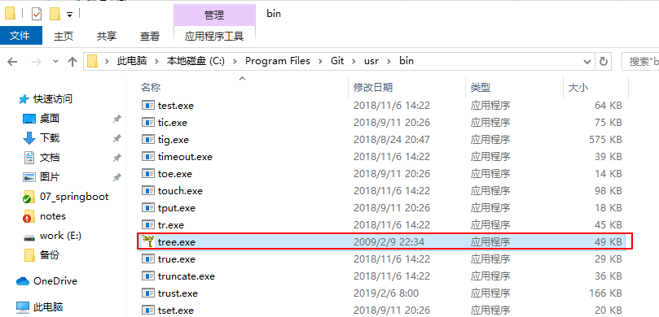

# 用命令行生成目录结构树

 tree是dos的一个命令 

**`功能`**:以图形的方式现实应用程序或者路径的目录结构

对于tree命令在windows坏境下的使用的,执行`help`命令,然后**`tree /?`**,其他windows的dos命令也是如此

**`官方解释`**:Tree是一个递归目录列表程序，它生成一个深度缩进的文件列表。给出目录参数时，树会列出给定目录中找到的所有文件和/或目录

**`缺陷`**:在windows DOS终端下,tree对应的参数功能有限,无法过滤特定的文件,而且在git bash终端下此命令却无法使用,如果要使用,特用特定的方法,后文中提供了具体的解决方法
 tree命令使用:

```
$ tree /?
以图形显示驱动器或路径的文件夹结构。

TREE [drive:][path] [/F] [/A]

   /F   显示每个文件夹中文件的名称。
   /A   使用 ASCII 字符，而不使用扩展字符。

```

输出到一个文件里

```
tree /f > list.txt
```


Git Bash中使用tree命令

 下载tree ， 载`Binaries版本`([http://gnuwin32.sourceforge.net/packages/tree.htm](https://links.jianshu.com/go?to=http%3A%2F%2Fgnuwin32.sourceforge.net%2Fpackages%2Ftree.htm)),如下图所示



 添加tree,将下载文件解压`bin/`目录下的 tree.exe 复制到 `git/usr/bin` 目录中,如下图所示: 



> 这是windows下tree在git命令行工具下使用文档'[http://mama.indstate.edu/users/ice/tree/](https://links.jianshu.com/go?to=http%3A%2F%2Fmama.indstate.edu%2Fusers%2Fice%2Ftree%2F)`


生成项目结构命令（html）:

```
$ tree -C -L 6 -T "项目结构" -H "spring-boot-jsp" --charset=gbk -I "spring-boot-jsp.iml" -o D://mmTree.html

-C 打开彩色
-L 6(向下深入6层级目录)
-T(用字符串替换默认的HTML标题和H1标题)
-I(忽略spring-boot-jsp.iml)
-O 输出到文件而不是stdout。
```

